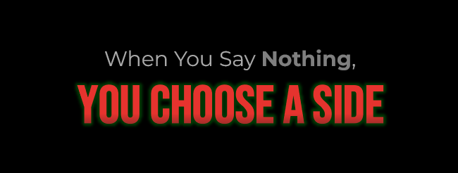

  
  

---

## 🚀 About Me

- 🔭 I'm currently working on **exciting projects** and expanding my skill set
- 🌱 I'm currently learning **new technologies** and best practices
- 👯 I'm looking to collaborate on **open-source forensic & cyber security projects**
- 💬 Ask me about **programming, technology, and Cyber Security**
- ⚡ Fun fact: **I love solving complex problems and turning ideas into reality!**
<!-- - 📫 How to reach me: **[Your Email]** or -->
- 📫 How to reach me: connect with me on **LinkedIn**

## 🛠️ Tech Stack & Tools

### Cybersecurity & Forensics

### Programming Languages

### Frameworks & Libraries

<!--  -->

### Databases & Cloud

### Development Tools

---

---

## 📊 GitHub Stats

  
  

  

  

---

## 🏆 GitHub Trophies

  

---

## 🚀 Featured Projects

---

## 🌐 Connect with Me

---

<!-- ## 💡 Inspirational Quote -->

  <!--  -->
  

---

---

  <h3>⭐ Star some repositories if you find them interesting! ⭐</h3>
  
<em>"Code is like humor. When you have to explain it, it's bad."</em>

  
  

&copy; 2025 Ahmad Rasheed. All rights reserved.

<!--
-## Hi there 👋

**Ahmad-Rasheed-01/Ahmad-Rasheed-01** is a ✨ _special_ ✨ repository because its `README.md` (this file) appears on your GitHub profile.

Here are some ideas to get you started:

- 🔭 I’m currently working on ...
- 🌱 I’m currently learning ...
- 👯 I’m looking to collaborate on ...
- 🤔 I’m looking for help with ...
- 💬 Ask me about ...
- 📫 How to reach me: ...
- 😄 Pronouns: ...
- ⚡ Fun fact: ...
-->

<!-- ## 🏅 Certifications & Learning

 -->

<!--

  

-->

<!-- > 💡 **Note**: Replace `your-project-1` and `your-project-2` with your actual repository names to showcase your best work! -->

---
<!-- 
## 📈 Coding Activity

  

 -->

<!-- ## 📈 Coding Activity -->
<!-- 

  

 -->

<!-- 
## 🐍 Contribution Snake

  

 -->

<!--  -->
<!--  -->
<!--  -->
<!--  -->